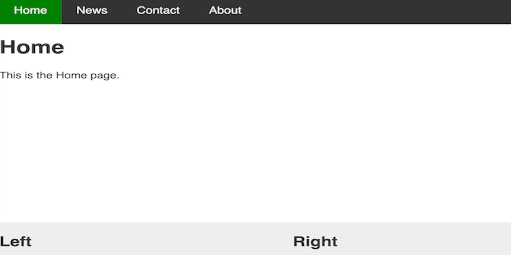

# Tutorial - Create a responsible layout with header, footer and sidebar

Create a responsive Layout with common header and footer part.

Using one html file for header and footer, these are dynamically insert in every page by javascript.

Live Demo is [here](https://coding4beginner.github.io/Tutorial_Create-responsible-layout-with-header-footer-and-sidebar/news.html)